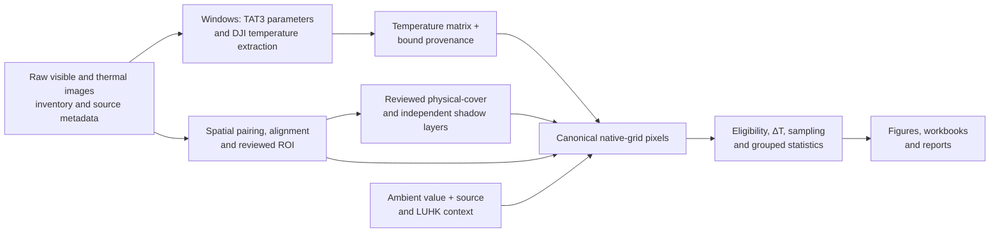

# Heat Index software architecture

This document describes the code on `stabilize/phase2-final`. The historical Parts A–E remain useful names for the research procedure and the numbered command-line programs. Reusable Python code is organized by responsibility in `heat_index/`. The matching files in `scripts/` and `scripts/workflow/` are compatibility entry points for existing commands and imports; the migration map is [phase2_module_migration.json](phase2_module_migration.json).

## Responsibilities and data flow

| Package | Responsibility |
|---|---|
| `heat_index.config` | Resolve the project root, logical `data/` paths, and a machine-local data-root override. |
| `heat_index.io` | Inventory and validate inputs; read tables, pilot records, and canonical per-image results. |
| `heat_index.provenance` | Capture time, camera/source metadata, typed result records, and source/cache identities. |
| `heat_index.spatial` | Footprints, grids, visible–thermal correspondence, reviewed alignment, and LUHK map context. |
| `heat_index.classification` | Physical surface-cover annotations, reviewed masks, and their native-grid mapping. |
| `heat_index.thermal` | TAT3 report parsing, DJI extraction, temperature loading, thermal quality checks, and thermal artifact provenance. |
| `heat_index.analysis` | Canonical pixel data, eligibility, sampling, ΔT, grouped statistics, validation, and temporal analysis. |
| `heat_index.visualization` | Review screens and scientific figures. |
| `heat_index.reporting` | Tables, workbooks, and human-readable reports. |
| `heat_index.pipeline` | Route selection, orchestration, stage runners, and user-facing command-line behavior. |

The native thermal pixel grid is the common spatial index for the temperature matrix, mapped cover labels, masks, and pixel table. Alignment candidates require review before they become accepted spatial evidence. LUHK provides separately sourced map context; visible–thermal alignment does not make LUHK georegistration exact. A pixel's ambient value and its definition/source stay distinguishable from the radiometric surface temperature. In particular, a TAT3 exported ambient *parameter* is provisional and is not automatically a measured meteorological air temperature.

## Stable handoffs

The thermal handoff is a two-dimensional float32 Celsius matrix together with its production metadata. `heat_index.thermal.artifact.write_thermal_artifact()` writes a versioned NPY + JSON pair; `load_thermal_artifact()` verifies the matrix checksum, image ID, shape/dtype, schema, source-image hash when supplied, and the fingerprint of the complete five-parameter radiometric set. For a historical `*_temperature_celsius.npy`, its sidecar is named `*_temperature_metadata.json`. The metadata retains source/engine, temperature definition and unit, available TAT3/DJI parameter values and their source, ambient provenance, and QA. Missing values remain unknown; a fingerprint is absent unless all five radiometric values are known. `load_temperature_override()` can read older or naked NPY files for compatibility but labels their binding unverified. A scientific consumer should require the verified pair when making a new cross-machine or cache claim. The Windows extractor and a Mac loader feed the same downstream native-grid analysis.

Classification supplies distinct native-grid physical-cover labels and a known/valid mask. Shadow is a separate overlay, never a physical-cover class. The current canonical pixel schema has `surface_cover_class`, `surface_cover_valid`, `shadow_flag`, and `shadow_valid`. A missing shadow mask becomes a null flag with `shadow_valid=false`; an available binary mask is currently treated as valid by the canonical writer. Historical default-zero masks may therefore conflate “reviewed unshaded” with “not assessed.” This uncertainty must be resolved and documented before Shadow data are used for a scientific contrast. The existing five tracked pilot masks contain no positive shadow pixels.

The pixel table also carries source, temperature definition/unit, ambient metadata, LUHK provenance, native thermal coordinates, eligibility, and ΔT. Analysis and visualization consume those recorded fields; a change of source or definition must not be silently pooled with another stratum. The current Part E cover × shadow code correctly treats an absent shaded group as a non-estimable contrast.

## Data and platform boundaries

The default logical data root is `<repository>/data`. `heat_index.config.paths.project_paths()` accepts a physical override from `HEAT_INDEX_DATA_ROOT` or, if that is unset, ignored `config/paths.local.json` (copy `config/paths.local.template.json`). `HEAT_INDEX_LOCAL_CONFIG` can select another local config file. Environment override takes precedence. Relative paths beginning `data/` map under the chosen physical root; other relative paths stay under the repository root. Use `resolve_path()` for inputs rather than the current working directory. A machine-local absolute path belongs in environment or ignored config, not shared scientific source.

The intended data areas are `data/raw/`, `data/external/`, `data/interim/`, `data/processed/`, and `data/meta/`. Large raw, external, intermediate, and derived payloads normally stay outside Git. Small reviewed metadata or a selected immutable fixture may be tracked deliberately. Existing tracked research reference files remain tracked. See [.gitignore](../.gitignore) and [windows_artifact_recovery.md](windows_artifact_recovery.md) before staging recovered data.

Genuine TAT3 and `dji_irp.exe` execution belongs to Windows with the original DJI environment. macOS can develop spatial/classification and downstream analysis, load a complete precomputed thermal artifact, run portable tests, and compare scientific outputs. A Windows-only extraction request on another host should fail with an intentional diagnostic; it must not be simulated as a successful extraction. Optional Excel automation is also a Windows/local boundary; portable table and report generation need no live Excel instance.

## Test layers and scientific reference

| Layer | What it checks | Typical execution |
|---|---|---|
| Unit | One function/component, e.g. ΔT given surface and ambient values. | Every developer and CI run. |
| Integration | Multiple components, e.g. artifact → mask → canonical pixels → summary. | Mac, Linux, Windows where inputs are portable. |
| Regression | Previously correct behavior after an edit. | Every developer and CI run. |
| Scientific regression | Equality or justified tolerance against the accepted `main` scientific result. | Synthetic in CI; accepted real fixture when recovered. |
| Windows/DJI integration | Real TAT3/DJI command and a pilot comparison. | Controlled Windows workstation with software and source inputs. |

`main` commit `06c61b499e9c3e2f30daaeddc29fa4e98d61066e` is the branch reference for Phase 2 comparison; its accepted production-code ancestor and run-scoped evidence are documented in [phase_1_accepted_baseline.md](baseline/phase_1_accepted_baseline.md). The synthetic replay recorded in [phase2_synthetic_regression_result.json](phase2_synthetic_regression_result.json) compared 24 NPY arrays, 22 CSV and 10 Parquet tables, and 41 PNG pixel arrays with exact equality to that `main` commit. This establishes synthetic parity for those routes only. The original accepted real thermal matrices and immutable run inputs are still needed for the real scientific gate. An accepted baseline must come from the recorded run scope, not a later mutable cache.

## Historical A–E map

| Research phase | Responsibility and present modules |
|---|---|
| Part A — inventory and metadata | `heat_index.io.inventory`, `heat_index.io.validation`, `heat_index.provenance.dji_metadata`, `capture_time`, `camera_profiles`. |
| Part B — spatial pairing, alignment, ROI | `heat_index.spatial` and `heat_index.visualization.alignment_review`. |
| Part C — surface review and masks | `heat_index.classification`, with context from `heat_index.spatial.landuse`. |
| Part D — radiometric extraction and QA | `heat_index.thermal`; provenance also uses `heat_index.provenance`. |
| Part E — pixels, ΔT, statistics, figures | `heat_index.analysis`, `heat_index.visualization`, `heat_index.reporting`, coordinated by `heat_index.pipeline`. |

The roadmap in [post_phase2_shadow_roadmap.md](post_phase2_shadow_roadmap.md) identifies where a later Shadow method will supply independent state and validity to classification, storage, QA, pixel tables, statistics, and figures. No detection method is part of this architecture baseline.
